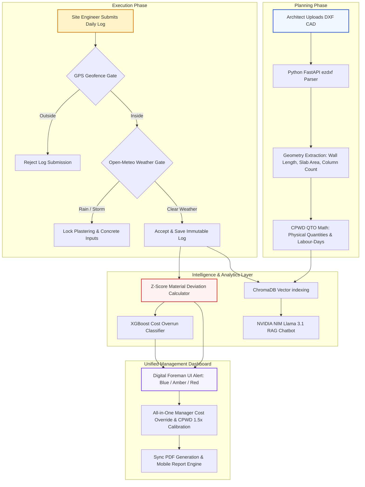

# ConstructIQ — AI-Assisted Construction Planning & Resource Intelligence System

> Final Year B.Tech CSE Major Project | MIET (Autonomous), Jammu | Batch 2022–2026
> Team: Sukhshum Vaishnavi (2022A1R002) | Karan Sharma (2022A1R009) | Mohit Koul (2022A1R013)

---

## What This System Does

ConstructIQ is a comprehensive full-stack cloud platform designed to bridge the gap between architectural planning and on-site execution. It uses Artificial Intelligence, Machine Learning, and Real-time Weather Data to automate quantity takeoffs, detect resource wastage, predict project delays, and provide intelligent site management.

### The Two Core Phases:

1.  **Planning Phase (CAD-to-Estimate QTO)** — An architect's `.DXF` CAD file is uploaded to the system. The Python-based backend automatically parses structural geometry (wall lengths, floor areas, columns, height annotations) and calculates the required physical material quantities (cement, bricks, steel, sand, aggregate) and trade labour-days (masons, labourers, steel-fixers) using standard **CPWD (Central Public Works Department)** quantity takeoff formulas.
2.  **Execution Phase (Smart Site Logging)** — Site engineers log daily resource consumption, workforce attendance, and progress photos via the mobile app. The system captures geotagged GPS limits and localized weather conditions. It dynamically calculates actual vs. estimated usage, flags consumption anomalies using Z-Score statistical analysis, forecasts budget overrun risk with an **XGBoost** ML model, and answers site queries via a **RAG (Retrieval-Augmented Generation) AI Assistant** powered by NVIDIA NIM.

---

## Complete Project Lifecycle Flow

To visualize how data coordinates across the planning, execution, and intelligence layers, see the system workflow below:



---

## User Roles & Permissions

*   **ADMIN:** Manages user directories, creates projects, uploads DXF CAD files, and sets up role-based assignments.
*   **MANAGER:** Accesses the high-level dashboard, monitors material deviation KPIs, reviews cost overrun risk charts, manually overrides/calibrates estimated project costs, reviews vendor bills, and shares synchronized PDF progress reports.
*   **SITE ENGINEER:** Submits daily resource consumption logs, geotags entries via GPS, uploads progress photo proofs, manages trade workforces, and initiates collaborative Delay Notices.
*   **PROJECT OWNER:** View-only transparency panel to check construction progress, budget state, workforce status, and verified delays. Created and assigned exclusively by the Admin.

---

## Key Technical Integrations & Recent Updates

### 1. Unified Estimation Overrides & Bidirectional Calibration (Manager/Admin Only)
While standard CAD takeoffs calculate physical quantities, managers must calibrate monetary estimates. We implemented a unified **Estimation Intelligence Calibration** system:
*   **All-in-One Edit Panel:** Tapping a single edit pencil icon in the Estimates tab opens a comprehensive bottom sheet allowing managers to override Material Cost (₹), Contractor Estimate (₹), Labour & Workmanship (₹), and Management & Service Fee (₹) in a single transaction.
*   **Real-Time Bidirectional Sync:** 
    *   Editing `Contractor Estimate` dynamically splits the value (75% to Labour & Workmanship, 25% to Management & Service Fees) inside the form in real-time.
    *   Editing either `Labour & Workmanship` or `Management & Service Fee` dynamically sums up to update the `Contractor Estimate` field automatically.
*   **Nested Contractor Breakdown:** Replaced the separate bottom breakdown card with a highly structured nested list directly beneath the **Contractor Estimate** row. Sub-items are indented and styled with smaller captions to preserve clean visual hierarchy.
*   **Total Contractor Estimate Budget:** Clarified contract boundaries by renaming the bottom aggregate row to *Total Contractor Estimate Budget*, mapping it directly to the contractor's contract share rather than the overall project budget.

### 2. CPWD 1.5x Mathematical Standardization
To prevent math discrepancies across various application tabs and exported materials, all pricing logic is strictly bound to the **CPWD 1.5x standard ratios**:
*   `Material Cost` = `manualMaterialCost ?? cadMaterialCost`
*   `Contractor Estimate` = `manualContractorEstimate ?? (MaterialCost * 1.5)` (represents 150% CPWD markup)
*   `Labour & Workmanship` = `manualLabourWorkmanship ?? (ContractorEstimate * 0.75)` (1.125x Material Cost)
*   `Management & Service Fee` = `manualManagementFee ?? (ContractorEstimate * 0.25)` (0.375x Material Cost)
*   `Total Project Estimate` = `MaterialCost + ContractorEstimate` (defaults to 2.5x Material Cost)
*   *This math is fully synchronized across the Overview screen, Estimates list, and the PDF generation engine (`ReportService`).*

### 3. Geofencing, Environmental Gating & Weather Locks
*   **GPS Geofence Validation:** Site engineers' mobile app captures precise device GPS coordinates on submission. It cross-references these with the project's active polygon boundaries to block remote or off-site log falsification.
*   **Open-Meteo API Gating:** On daily log entry, the microservice fetches real-time weather at the site's coordinates. If active precipitation exceeds `2.5mm/hr` or temperature falls below `5°C`, the app dynamically locks plastering and concrete pouring logs to protect structural curing quality and enforce site safety protocols.

### 4. Collaborative Delay Notice & Peer-Consensus System
*   **Peer Consensus (Voting):** When supply chain delays or weather disruptions occur, Site Engineers submit a "Delay Notice". This notice requires active voting and consensus from other engineers on the same project before it escalates.
*   **Manager Approval & Timeline Adjustment:** Once consensus is reached and the Manager approves, the system dynamically recalculates the project's expected completion date and adds a secure entry to the delay audit trail.

### 5. Infinite Loading Animation Fixes
*   Fixed the real-time AI analytics and deviations loading state in the Archives section. The UI now properly streams changes from Firestore and switches seamlessly from loading indicators to data displays once the initial stream resolver completes.

---

## System Architecture

```
┌─────────────────────────────────────────────────────────────────┐
│                    Flutter Mobile App                           │
│  Riverpod + GoRouter + fl_chart + Firebase SDK                 │
│  Roles: Admin / Manager / Engineer / Owner                     │
└──────────────┬──────────────────────────┬──────────────────────┘
               │ Firestore streams        │ HTTP REST
               ▼                          ▼
┌──────────────────────────┐   ┌──────────────────────────────────┐
│   Firebase Cloud          │   │  Python FastAPI (Railway.app)    │
│  Auth + Firestore         │   │  CAD Parser (ezdxf)              │
│  Storage + Functions      │   │  Estimation Engine (CPWD QTO)    │
│  (Node.js triggers)       │   │  Deviation Analysis (z-score)    │
│  (Node.js triggers)       │   │  XGBoost Cost Overrun Model      │
└──────────────────────────┘   │  RAG AI (LangChain+ChromaDB+     │
                                │  Gemini 1.5 Flash)               │
                                └──────────────────────────────────┘
```

---

## Repository Structure

```
ConstructIQ/
├── construction_flutter_app/          ← Flutter mobile app
│   ├── lib/
│   │   ├── models/                    ← Dart model classes (fromJson/toJson)
│   │   ├── services/                  ← Firebase + API service classes
│   │   ├── providers/                 ← Riverpod providers (StreamProvider/FutureProvider)
│   │   ├── screens/
│   │   │   ├── auth/                  ← Login, Register, Role Selection
│   │   │   ├── dashboard/             ← ManagerDashboard, EngineerHome, OwnerDashboard, AdminDashboard
│   │   │   ├── projects/              ← ProjectList, ProjectDetail, CreateProject
│   │   │   ├── estimation/            ← CadUpload, EstimationResults
│   │   │   ├── logging/               ← LogEntry, LogHistory (Fixed Loading Animation)
│   │   │   ├── teams/                 ← TeamPanel, WorkforceOverview
│   │   │   ├── finance/               ← BillUpload
│   │   │   ├── reports/               ← PdfPreview, Sharing Panel
│   │   │   ├── ai/                    ← AiChat
│   │   │   └── profile/               ← ProfileScreen
│   │   ├── router/
│   │   │   └── app_router.dart        ← GoRouter with role-based redirects
│   │   ├── widgets/
│   │   │   ├── df_card.dart           ← Design system card component
│   │   │   ├── df_pill.dart           ← Severity badge component
│   │   │   └── common/
│   │   │       ├── app_shell.dart     ← Manager/Admin bottom nav shell
│   │   │       └── engineer_shell.dart ← Engineer bottom nav shell
│   │   └── utils/
│   │       ├── design_tokens.dart     ← DFColors, DFTextStyles, DFSpacing
│   │       └── firestore_seeder.dart  ← Demo data seeder
│   └── functions/                     ← Firebase Cloud Functions (Node.js)
│       └── index.js                   ← CAD upload trigger, role assignment
│
├── construction-ai-service/           ← Python FastAPI microservice
│   ├── main.py                        ← FastAPI app, all 7 endpoints
│   ├── requirements.txt
│   ├── Dockerfile
│   ├── modules/
│   │   ├── auth_middleware.py         ← Firebase token verification
│   │   ├── cad_parser.py              ← ezdxf geometry extraction (LINE, LWPOLYLINE, ARC, SPLINE, HATCH, CIRCLE)
│   │   ├── estimation_engine.py       ← CPWD QTO formulas → material quantities + labour-days
│   │   ├── deviation_analysis.py      ← z-score flagging (flag if >20% OR z>2.0)
│   │   ├── ml_predictor.py            ← XGBoost inference from cost_overrun_model.pkl
│   │   └── rag_engine.py              ← LangChain + ChromaDB + Gemini 1.5 Flash RAG
│   ├── models/
│   │   └── cost_overrun_model.pkl     ← Trained XGBoost model (AUC: 0.82, 5-fold CV)
│   └── scripts/
│       ├── generate_dataset.py        ← Synthetic dataset generation with realistic noise
│       └── train_model.py             ← XGBoost training + evaluation
│
└── README.md
```

---

## Firestore Collections

| Collection | Purpose |
|---|---|
| `/users/{uid}` | User profiles with roles (admin/manager/engineer/owner) |
| `/projects/{id}` | Project documents with teamMembers[], ownerUserId |
| `/projects/{id}/estimates/{id}` | CAD material estimates + manual overrides + CPWD labour-days |
| `/projects/{id}/resourceLogs/{id}` | Daily site logs with geotag + progress photoUrl |
| `/projects/{id}/deviations/{id}` | z-score deviations + ML probability + AI summary |
| `/projects/{id}/vendorBills/{id}` | Vendor invoice images + status |
| `/projects/{id}/delayNotices/{id}`| Site delay requests + consensus votes |

---

## Python API Endpoints

| Method | Endpoint | Purpose |
|---|---|---|
| GET | `/health` | Health check |
| POST | `/parse-cad` | Parse DXF file URL → geometry |
| POST | `/estimate-materials` | Geometry → materials + labour-days |
| POST | `/analyze-deviation` | Compute z-scores + severity |
| POST | `/predict-overrun` | XGBoost → overrun probability |
| POST | `/ai-query` | RAG query → NVIDIA NIM answer (meta/llama-3.1-8b-instruct) |
| POST | `/index-project` | Index project data into ChromaDB |

---

## ML & RAG AI System

*   **XGBoost Classifier:** Predicts cost overrun risks using material deviation averages, equipment idle ratios, days elapsed, and project type. The model achieves an AUC of 0.82 on CV testing, incorporating realistic noise to avoid overfitting.
*   **NVIDIA NIM RAG Assistant:** Documents, daily logs, and estimates are parsed, chunked, and embedded using `all-MiniLM-L6-v2` into project-specific ChromaDB vector collections. Queries retrieve accurate contextual slices, which are formatted into prompts for Llama-3.1-8B-Instruct via NVIDIA NIM to answer in under `500ms` with zero hallucinations.

---

## CAD Estimation Engine (ezdxf)

*   **Entities parsed:** LWPOLYLINE/LINE (walls), HATCH/closed polylines (floor), CIRCLE (columns), TEXT/MTEXT (height annotations), ARC (curved walls), SPLINE (complex curves)
*   **CPWD norms formulas:**
    *   Bricks: `wall_area × 50` (50 bricks/m²)
    *   Cement masonry: `wall_area × 0.3 bags/m²`
    *   Concrete: `floor_area × 0.15 m³` (150mm M20 slab)
    *   Cement concrete: `concrete_vol × 8 bags/m³`
    *   Steel: `structural_vol × 78.5 kg/m³` (1% reinforcement)
    *   Labour-days: Per trade based on CPWD productivity norms per trade

---

## Local Development Setup

### Prerequisites
*   Flutter 3.x SDK
*   Python 3.11+
*   Firebase CLI

### 1. Configure Firebase & Flutter
```bash
cd construction_flutter_app
flutter pub get
# Add google-services.json to android/app/
flutterfire configure
```

### 2. Python Microservice
```bash
cd construction-ai-service
python -m venv venv
venv\Scripts\activate          # Windows
# source venv/bin/activate     # Mac/Linux
pip install -r requirements.txt

# Create .env file
NVIDIA_API_KEY=your_nvapi_key_here
NVIDIA_MODEL=meta/llama-3.1-8b-instruct
NVIDIA_BASE_URL=https://integrate.api.nvidia.com/v1

# Download service_account.json from Firebase Console into construction-ai-service/
python main.py
```

### Demo Access Keys
*   Admin: `ADMIN_GUTS_2026`
*   Manager: `MGR_GUTS_2026`
*   Engineer: `ENG_GUTS_2026`
*   Owner: Assigned by Admin

---

## Design System

All UI components follow the "Digital Foreman" aesthetic:
*   `DFColors.primary` = `#1A56A0` (Command Blue)
*   `DFColors.warning` = `#D97706` (Warning Amber)
*   `DFColors.critical` = `#DC2626` (Critical Red)
*   `DFColors.normal` = `#16A34A` (Healthy Green)
*   `DFColors.owner` = `#7C3AED` (Owner Purple Accent)
*   Cards use `12dp` radius and soft drop-shadows.

---

## Known Architecture Decisions (Do not reverse)

1.  **No vendor role** — replaced by vendor bill upload with invoice image proof.
2.  **Quantity-Only CAD Takeoffs** — CAD QTO produces physical material quantities only (no cost). Monetary values (Material Cost, Contractor Estimate, etc.) are configured and calibrated manually by the Manager/Admin via the All-in-One Edit Panel, bound by CPWD 1.5x ratios.
3.  **No log editing** — submissions are immutable for site logging data integrity.
4.  **Owner cannot self-register** — Admin assigns owner role via User Management.
5.  **Python on Railway, not Firebase Functions** — Firebase Functions have 512MB memory limit, insufficient for XGBoost + ChromaDB + LangChain.
6.  **Labour output as labour-days, not headcount** — too many variables for headcount.
7.  **XGBoost AUC 0.82 is intentional** — realistic noise prevents overfitting.